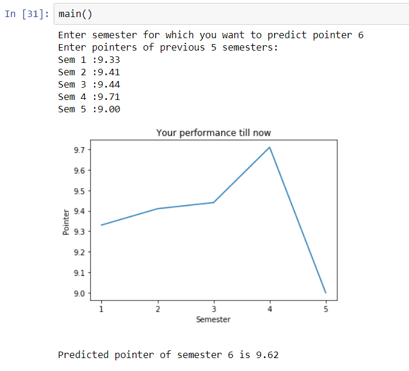
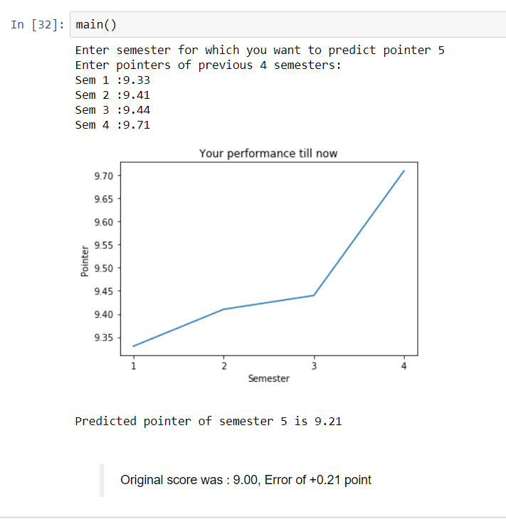

# Student-pointer-prediction-using-Linear-Regression
Student pointer prediction in python using Linear Regression model. 
The prediction is based on student's all previous semesters performance.

The decision tree model gives similar results.

Assumption : Although there are many factors involved in prediction of pointer, this project assumes that the current semester pointer depends only on previous performance of student i.e. previous semester pointers.

Accuracy : Ranges from moderate to low because of very limited dataset of just 15 observations each consisting of all eight semester pointers of students from previous batch, absence of other factors affecting pointer and limitations of model used.
RMSE is around 0.8 which need to be minimised.

### Output

Repository open for pull request in case any contributor can come up with different model or introduce other factors affecting pointer thus improving accuracy of prediction and reduction in RMSE
